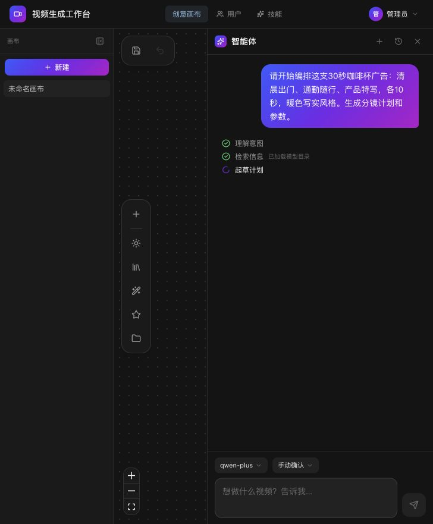

# AI 视频生成与编排工作台

一个面向多镜头视频制作的 Web 应用。用户可以在节点画布中组合提示词、图片、视频、音频、视频生成和最终输出节点，也可以让创作智能体根据自然语言生成、修改并执行画布计划。

当前文档按仓库代码于 **2026-09-14** 校准。模型能力以 `backend/app/catalog.py` 为唯一事实来源，部署参数以 `.env.example` 和 `backend/app/config.py` 为准。



## 当前能力

| 模块 | 已实现能力 |
| --- | --- |
| 创意画布 | 创建、保存、重命名和删除画布；拖拽节点、连线、缩放、撤销；深浅主题 |
| 节点编排 | 提示词、图片、视频、音频、生成、输出六类节点；类型和数量校验；生成结果可作为下游参考视频 |
| 视频生成 | 文生视频、图生视频、参考生视频；首帧/尾帧；多模态参考；分辨率、比例、时长、水印和音频参数 |
| 画布运行 | 单节点生成、全画布增量运行、独立镜头并发、依赖调度、失败隔离、结果复用、FFmpeg 拼接与转场 |
| 创作智能体 | 多轮对话、意图分类、流式回复、技能选择、工具调用、结构化计划、计划校验/修复、成本闸门、自动执行 |
| 画布接管 | Agent 读取和原子修改画布、计划落图、操作撤销、版本冲突保护、人工接手使在途写操作失效 |
| 运行控制 | 持久化输入快照、可重放事件、刷新/重启后恢复、取消后续任务、失败分支有限重试 |
| 素材库 | 上传图片/视频/音频、登记公网外链、筛选和搜索、拖入画布、用户级归属隔离 |
| 管理 | JWT 登录、管理员/普通用户权限、账号管理、提示词技能管理、密码修改 |
| 存储与安全 | SQLite、媒体签名链接、Range 播放、上传内容校验、登录锁定、CORS/Host/HTTPS 防护、过期视频清理 |

## 模型能力

| 模型 | 文生 | 图生 | 参考生 | 可用角色 | 分辨率 | 时长（默认全局上限 15 秒） |
| --- | :---: | :---: | :---: | --- | --- | --- |
| `wan3.0-video-prime` | ✓ | 首帧 + 可选尾帧 | 图片/视频/音频 | 管理员 | 480P / 720P / 1080P | 2–15 秒 |
| `MiniMax/MiniMax-H3` | ✓ | 首帧 + 可选尾帧 | 图片/视频/驱动音频 | 管理员 | 768P / 2K | 4–15 秒 |
| `happyhorse-1.1-t2v` | ✓ | — | — | 全部用户 | 480P / 720P / 1080P | 3–15 秒 |
| `happyhorse-1.1-i2v` | — | 单首帧 | — | 全部用户 | 480P / 720P / 1080P | 3–15 秒 |
| `happyhorse-1.1-r2v` | — | — | 1–9 张图片 | 全部用户 | 480P / 720P / 1080P | 3–15 秒 |

需要注意：

- Wan 3.0 官方可生成更长视频，但系统会用 `MAX_VIDEO_DURATION` 收窄可选时长。
- MiniMax 文生视频必须选择明确比例；图生视频比例跟随输入；图片不接受 Base64，需配置可公网访问的 `PUBLIC_BASE_URL`。
- HappyHorse I2V 的比例跟随首帧，不提供比例参数；HappyHorse 默认开启水印。
- Wan/MiniMax 的首尾帧输入不能与参考生视频的多模态素材混用。
- 参考素材的类型、数量、大小和供应商字段在后端再次校验，不能只依赖前端限制。

## 使用流程

### 手动画布

1. 登录后在左侧创建或选择画布。
2. 从“添加节点”加入提示词、素材、生成和输出节点，或从素材库拖入已有素材。
3. 将提示词/素材连接到生成节点，选择模型和参数。
4. 单击生成节点上的运行按钮只生成当前镜头；“一键运行画布”会运行所有新增、失败、过期或输入已变化的镜头。
5. 将多个生成节点连接到输出节点，在输出节点内排序片段并选择转场，然后运行画布或手动重新合成。

全画布运行会复用输入未变化的成功镜头。移动节点、缩放画布和调整输出顺序不会重新生成镜头；修改提示词、模型参数、素材顺序或上游生成结果会使相关结果失效。详细规则见 [画布运行说明](docs/canvas-run.md)。

### 创作智能体

1. 先创建或选择目标画布，再打开底部智能体。
2. 选择 Agent 模型以及“手动确认”或“自动执行”。
3. 用自然语言描述目标，例如“做一个 15 秒、三个镜头的雨夜汽车广告”。
4. 智能体会读取模型目录和当前画布，必要时检索素材/历史或读取用户明确给出的 URL，然后返回可校验的结构化计划。
5. 手动确认模式可先“绘制到画布”或执行；自动执行仅在计划合法且未超过成本、节点数和每日预算限制时启动。
6. 运行中可查看各镜头状态、取消后续任务或重试失败分支；单击“人工接手”会阻止旧 Agent 写入覆盖当前编辑。

如果未配置 LLM Provider 且 `AGENT_FALLBACK_RULES=true`，系统使用规则规划器生成基础计划，仍会经过权限和参数校验。

## 快速启动

### Docker Compose（推荐）

```bash
cp .env.example .env
```

至少修改：

```ini
SECRET_KEY=<至少 32 字节的随机值>
ADMIN_USERNAME=admin
ADMIN_PASSWORD=<强密码>
DASHSCOPE_API_KEY_WAN=sk-xxx
DASHSCOPE_API_KEY_HAPPYHORSE=sk-yyy
PUBLIC_BASE_URL=http://<阿里云可访问的公网 IP>:8008
```

生成签名密钥：

```bash
python -c "import secrets; print(secrets.token_hex(32))"
```

构建并启动：

```bash
docker compose up -d --build
```

访问 `http://localhost:8008`，健康检查地址为 `http://localhost:8008/api/health`。

使用域名和自动 HTTPS 时，先把域名解析到服务器并在 `.env` 中配置：

```ini
APP_DOMAIN=video.example.com
USE_HTTPS=true
BEHIND_PROXY=true
FORCE_HTTPS=false
```

然后启动 Caddy profile：

```bash
docker compose --profile caddy up -d --build
```

证书生效后再设置 `FORCE_HTTPS=true`。完整生产步骤见 [DEPLOY.md](DEPLOY.md)。

### 本地开发

要求：Python 3.11+、Node.js 20+、FFmpeg/FFprobe。

后端：

```bash
python -m venv .venv
```

```bash
pip install -r backend/requirements.txt
```

```bash
uvicorn backend.app.main:app --reload --port 8008
```

前端：

```bash
cd frontend
npm install
npm run dev
```

开发地址为 `http://localhost:5173`。Vite 将 `/api` 和 `/media` 代理到 `http://localhost:8008`。

## 技术栈

| 层 | 技术 |
| --- | --- |
| 前端 | React 18、TypeScript、Vite 5、React Router、`@xyflow/react`、Ant Design 5、Radix UI、Tailwind CSS 4、Axios |
| 后端 | Python 3.11、FastAPI、Uvicorn、Pydantic 2、SQLAlchemy 2、HTTPX、PyJWT、AsyncIO |
| 数据与媒体 | SQLite、宿主机文件卷、FFmpeg/FFprobe、签名媒体链接与 HTTP Range |
| 外部服务 | 阿里云百炼/DashScope 异步视频任务；OpenAI Chat Completions 兼容的 Agent Provider |
| 测试 | Pytest、Playwright |
| 部署 | 多阶段 Docker 镜像、Docker Compose；可选 Caddy 或 Nginx |

生产镜像先用 Node 编译前端，再由 FastAPI 同时提供 API、签名媒体接口和 SPA 静态文件。当前任务调度由应用内 AsyncIO 完成，没有外置队列或 Redis；SQLite 和单进程部署是默认运行形态。

## 目录结构

```text
VideoGenerate/
├─ backend/
│  ├─ app/
│  │  ├─ routers/              # auth/users/assets/canvas/agent 等 HTTP API
│  │  ├─ catalog.py            # 视频模型能力唯一事实来源
│  │  ├─ canvas_service.py     # 画布事务、版本、计划导入与 Agent patch
│  │  ├─ canvas_run_service.py # 手动画布运行编译与调度
│  │  ├─ agent_chat.py         # Agent 对话、流式事件、工具循环与计划提取
│  │  ├─ agent_run_service.py  # 接受计划、运行快照、取消/重试与持久事件
│  │  ├─ agent_executor.py     # 依赖调度、生成与合成执行
│  │  └─ tasks.py              # DashScope 提交、轮询、下载与恢复
│  └─ tests/
├─ frontend/
│  ├─ src/pages/Canvas.tsx     # React Flow 主画布
│  ├─ src/components/nodes/    # 六类节点组件
│  └─ src/components/agent/    # Agent 抽屉、记录、计划与进度组件
├─ docs/                       # 画布与 Agent 开发文档
├─ deploy/                     # Caddy/Nginx 配置
├─ data/                       # 运行数据（默认不入库）
├─ Dockerfile
└─ docker-compose.yml
```

## 核心数据流

```text
React Flow 画布 / Agent 对话
              │ REST + SSE
              ▼
FastAPI ── 画布校验/计划校验/权限与成本闸门
              │
              ├─ SQLAlchemy + SQLite：用户、画布、消息、运行、任务、事件
              ├─ DashScope：提交并轮询视频任务
              └─ FFmpeg：下载片段、转场拼接、保存最终视频
```

- 手动画布运行和 Agent 计划运行最终共用 `AgentRun`/`AgentTask` 执行模型。
- 开始运行时冻结完整输入；后续画布修改不会改变在途请求。
- Agent 规划事件和运行事件分别支持断线恢复；运行事件持久化到数据库。
- 应用启动时会恢复未完成的视频任务和 Agent 运行，并执行一次过期文件清理。

## API 概览

所有业务接口都要求登录，媒体签名链接除外。

| 前缀 | 用途 |
| --- | --- |
| `/api/auth` | 登录、当前用户、修改密码 |
| `/api/users` | 管理员用户管理 |
| `/api/models`、`/api/config` | 当前用户可用模型及公开配置 |
| `/api/uploads`、`/api/assets` | 上传和素材库 |
| `/api/canvases` | 画布 CRUD、图保存、节点/整图运行、Agent patch/undo/takeover |
| `/api/agent` | Agent 模型、工具、轮次、SSE、计划接受/落图、运行查询/取消/重试 |
| `/api/skills` | 管理员提示词技能管理 |
| `/api/conversations` | 兼容的对话和直接生成接口，画布内部也用隐藏对话保存消息 |
| `/api/messages`、`/media` | 视频下载和签名媒体访问 |

FastAPI 交互文档在开发环境可通过 `/docs` 查看。

## 配置

完整模板见 [.env.example](.env.example)。下表仅列常用项。

### 基础与视频通道

| 变量 | 默认值 | 说明 |
| --- | --- | --- |
| `PORT` | `8008` | 应用和 Compose 暴露端口 |
| `SECRET_KEY` | 不安全示例值 | JWT 和媒体签名密钥，生产必须修改 |
| `ADMIN_USERNAME` / `ADMIN_PASSWORD` | `admin` / `admin123` | 首次启动创建管理员；生产必须修改 |
| `DASHSCOPE_API_KEY_WAN` | 空 | Wan/MiniMax 通道，也是 HappyHorse 备用通道 |
| `DASHSCOPE_API_KEY_HAPPYHORSE` | 空 | HappyHorse 首选 Token Plan 通道 |
| `MAX_VIDEO_DURATION` | `15` | 系统允许的单镜头最长时长 |
| `POLL_INTERVAL_SECONDS` | `8` | 供应商任务轮询间隔 |
| `POLL_TIMEOUT_SECONDS` | `1800` | 单任务等待上限 |
| `DOWNLOAD_VIDEOS` | `true` | 成功后保存视频到本地；画布拼接仍会按需下载片段 |

### 域名、媒体与安全

| 变量 | 默认值 | 说明 |
| --- | --- | --- |
| `APP_DOMAIN` | 空 | 填写后推导公网 URL、CORS 和可信 Host |
| `PUBLIC_BASE_URL` | 由域名推导 | DashScope 回源素材时使用的公网根地址 |
| `ALLOWED_ORIGINS` | 同源 | 跨域白名单，逗号分隔 |
| `TRUSTED_HOSTS` | 由域名推导 | Host 头白名单 |
| `BEHIND_PROXY` | `false` | 是否信任反向代理头 |
| `FORCE_HTTPS` | `false` | HTTPS 跳转和 HSTS，证书生效后再开启 |
| `MAX_UPLOAD_MB` | `20` | 通用上传上限；具体模型槽位还会应用更细限制 |
| `MEDIA_LINK_TTL_SECONDS` | `21600` | 签名媒体链接有效期 |
| `VIDEO_RETENTION_DAYS` | `7` | 本地视频保留天数；`<=0` 关闭清理 |
| `CLEANUP_INTERVAL_HOURS` | `6` | 自动清理间隔 |

### 创作智能体

| 变量 | 默认值 | 说明 |
| --- | --- | --- |
| `AGENT_ENABLED` | `true` | Agent 总开关 |
| `AGENT_MODELS_JSON` | `[]` | 多模型目录；密钥通过各条目的 `api_key_env` 引用 |
| `AGENT_DEFAULT_MODEL` | 空 | Agent 和对话上下文默认模型 |
| `AGENT_PROVIDER` | `openai` | 单模型兼容配置的协议类型 |
| `AGENT_BASE_URL` / `AGENT_MODEL` / `AGENT_API_KEY` | 见模板 | OpenAI 兼容单模型配置；Key 留空时复用 Wan Key |
| `AGENT_MAX_AUTO_COST` | `20` | 单计划自动执行金额上限 |
| `AGENT_MAX_AUTO_NODES` | `3` | 自动执行节点上限 |
| `AGENT_DAILY_COST_LIMIT` | `200` | 用户每日计划执行金额上限 |
| `AGENT_DAILY_TOKEN_LIMIT` | `200000` | 用户每日 Agent token 上限 |
| `AGENT_MAX_TOOL_CALLS` | `5` | 单轮工具调用上限 |
| `AGENT_PLAN_TTL_MINUTES` | `60` | 计划有效期 |
| `AGENT_FALLBACK_RULES` | `true` | Provider 不可用时允许规则计划 |
| `AGENT_RUN_CONCURRENCY` | `2` | 单次运行内的生成任务并发数 |
| `AGENT_TASK_MAX_ATTEMPTS` | `2` | 单任务最大尝试次数（包含首次执行） |

`AGENT_PRICE_TABLE` 未配置的档位使用 `AGENT_PRICE_DEFAULT` 估算。金额用于本地闸门和展示，不代表供应商最终账单。

多模型示例：

```ini
AGENT_MODELS_JSON=[{"id":"qwen-plus","name":"Qwen Plus","provider":"openai","base_url":"https://dashscope.aliyuncs.com/compatible-mode/v1","api_key_env":"AGENT_QWEN_KEY"}]
AGENT_DEFAULT_MODEL=qwen-plus
AGENT_QWEN_KEY=sk-xxx
```

## 公网素材地址

DashScope 会主动下载提交的素材：

| 情况 | 行为 |
| --- | --- |
| 配置了可用的 `PUBLIC_BASE_URL` | 使用带签名的公网 URL |
| 未配置，且模型支持 Base64 | Wan/HappyHorse 图片改用 Base64 |
| 未配置，且模型不支持 Base64 | MiniMax 图片输入会被拒绝并提示配置公网地址 |

`localhost`、回环地址和常见内网地址不能作为阿里云回源地址。素材外链也必须是合法的 `http(s)` 公网地址。

## 测试

后端：

```bash
pytest backend/tests
```

前端构建：

```bash
cd frontend
npm run build
```

Playwright：

```bash
cd frontend
npx playwright test
```

画布合成测试需要本机可调用 FFmpeg/FFprobe。部分端到端测试会按 `frontend/playwright.config.ts` 启动开发服务。

## 文档索引

- [生产部署与运维](DEPLOY.md)
- [画布运行、复用与素材引用](docs/canvas-run.md)
- [创作智能体总体架构](docs/agent-design.md)
- [Agent v3 对话与事件协议](docs/agent-v3-design.md)
- [Agent 画布接管与一致性约束](docs/agent-canvas-takeover-plan.md)

## 当前边界

- 视频生成只接入 `catalog.py` 中列出的 DashScope 模型；新增模型应先扩展目录和校验，而不是在前端硬编码。
- 默认 SQLite + 单应用进程，适合单机部署；多实例部署需要共享数据库、共享媒体存储以及跨进程事件/任务协调。
- “取消运行”会立即取消尚未提交的后续任务，但供应商已接受的生成任务不保证能够远程撤销。
- Agent 的计划、工具结果和成本估算都必须经过后端验证；模型输出本身不构成执行授权。
- 系统只判断生成任务和文件处理是否成功，不包含独立的视频内容质量审核或自动无限重生成。
